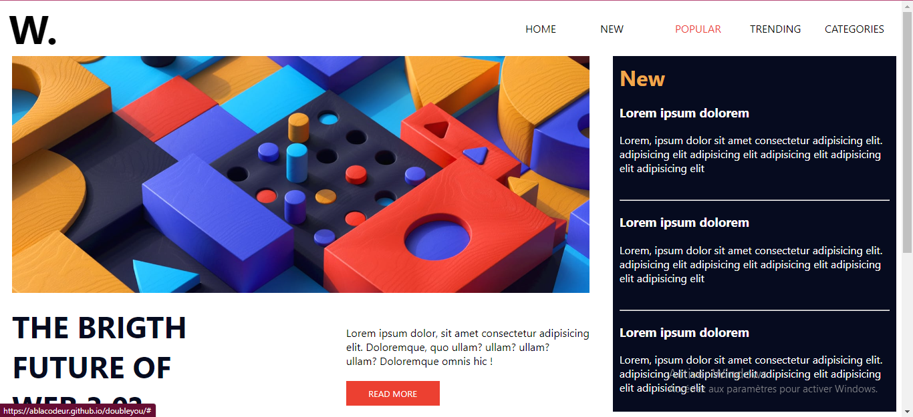

# Ablacodeur - News homepage solution 🚀

## Table of contents

- [Overview](#overview)
  - [Screenshot](#screenshot)
  - [Links](#links)
- [My process](#my-process)
  - [Built with](#built-with)
  - [What I learned](#what-i-learned)
  - [Useful resources](#useful-resources)
- [Author](#author)


## Overview
Hello  everyone 👋,am back with a new simple challenge that i have done,this challenge help me to improve my css and javascript skills ... let me show ....TADAAAAAAM

### Screenshot




### Links

- Solution URL: [https://github.com/Ablacodeur/doubleyou]
- Live Site URL: [https://ablacodeur.github.io/doubleyou]

## My process

### Built with
- love
- Semantic HTML5 markup
- CSS custom properties
- Flexbox
- CSS Grid
- javascript

### What I learned

Use this section to recap over some of your major learnings while working through this project. Writing these out and providing code samples of areas you want to highlight is a great way to reinforce your own knowledge.

To see how you can add code snippets, see below:

```html
.proud-of-this-html {
  <aside>
          <span class="yellow">New</span>
          <h3>Lorem ipsum dolorem</h3>
          <p>Lorem, ipsum dolor sit amet consectetur adipisicing elit. 
            adipisicing elit adipisicing elit adipisicing elit adipisicing elit
            adipisicing elit <br> <br>
          <hr>
          </p>

          <h3>Lorem ipsum dolorem</h3>
          <p>Lorem, ipsum dolor sit amet consectetur adipisicing elit. 
            adipisicing elit adipisicing elit adipisicing elit adipisicing elit adipisicing elit <br> <br>
          <hr>
          </p>

          <h3>Lorem ipsum dolorem</h3>
          <p>Lorem, ipsum dolor sit amet consectetur adipisicing elit.
            adipisicing elit adipisicing elit adipisicing elit adipisicing elit adipisicing elit <br> 
          </p>
  </aside>
}
```
```css
.proud-of-this-css {
    .nav div.show_list{
        height: 700px;
        position: absolute !important;
    }

}
```

### Useful resources

- [https://codepen.io/abdosteif/pen/bRoyMb]- This helped me for my toggle nav. 
## Author

- Website - [Ablacodeur](https://github.com/Ablacodeur)
- Twitter - [@Ablacodeur](https://twitter.com/Ablacodeur)


## Acknowledgments

I have start this challenge with 
- Website - [Samuel](https://github.com/kodjozecodeur)

